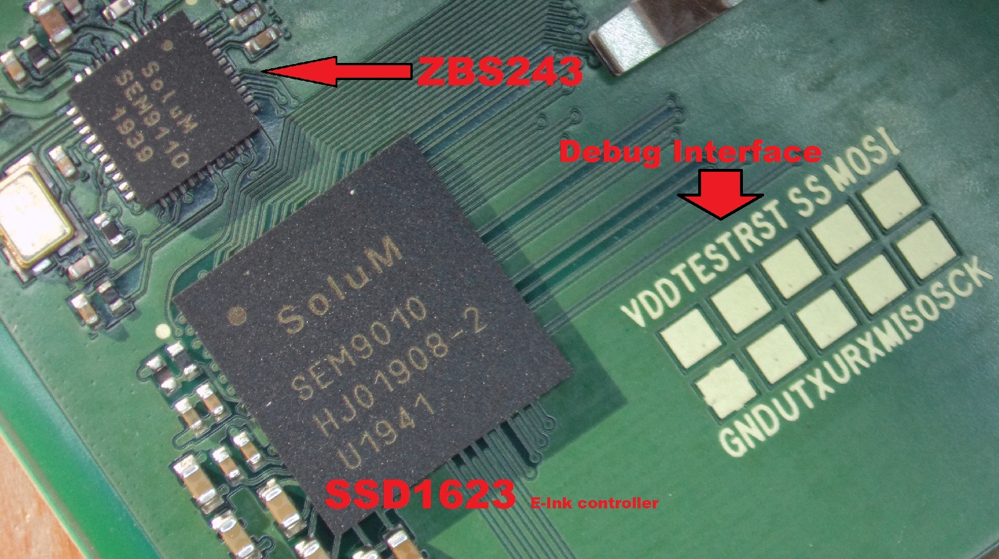
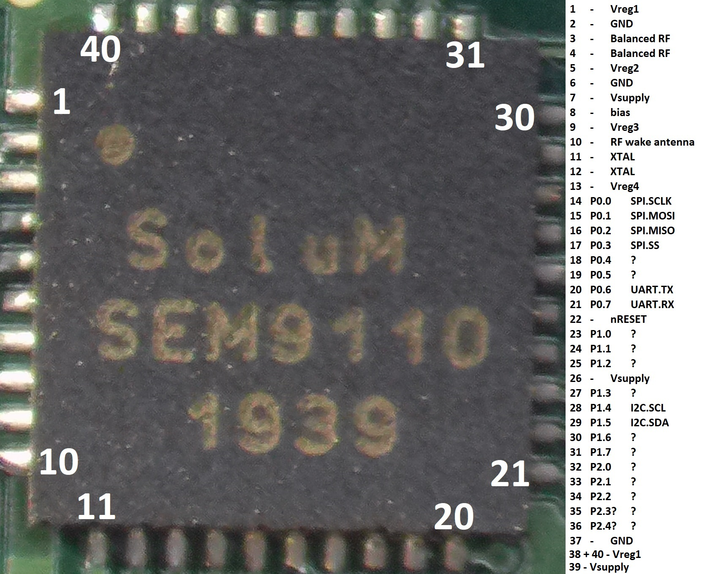

# ZBS_Flasher

### By Aaron Christophel <https://ATCnetz.de>

### You can support my work via PayPal: <https://paypal.me/hoverboard1> this keeps projects like this coming

Ardunio / C++ Library and interface to flash the ZBS243 / SEM9110 8051 Microcontroller

The ZBS243 is an 8051 Zigbee Enabled SOC with 64KB of Flash and 1KB of EEPROM Like Infopage, 256Byte+8KB RAM is available.

It is used in the Electronic Shelf Labels made by SOLUM and rebranded with the name SEM9110

Here is a YouTube video that shows the general function
https://youtu.be/QqyUzDRQEqA

[](https://www.youtube.com/watch?v=QqyUzDRQEqA)

Chip Picture:



ZBS243 Pinout:



2.9" amd 1.54" SOLUM Electronic Shelf Label flashing Pinout:


The debug interface is an SPI like connection and the debug mode is entered via toggling the CLK signal while a reset is done.

Many more infos about the ZBS243 can be found here: [Reverse Engineering an Unknown SOC](https://dmitry.gr/?r=05.Projects&proj=30.%20Reverse%20Engineering%20an%20Unknown%20Microcontroller)

This Project enables simple Reading and Writing of the Flash/Infopage

It is written for the ESP32 but should run basically on any SOC with ~8 GPIOS and UART.

# You need

  Virsual Studio code
  
  PlatformIO
  
  Python > 3.0
  
    for Python you need: pyserial ( pip install pyserial )
  
# How to get Started

## Flashing "Dmitrys" Firmware: [HowTo](custom-firmware/README.md)

  Load the Project folder into Virsual Studio Code, select the Correct COM port in the platformio.ini
  
  Flash it to an ESP32 or Arduino Nano
  
  After that you can use the python tool zbs_flasher.py(zbs_flasher.exe precompiled, may triggers Anti Virus software) with the following parameter:
  
    zbs_flasher COMxx read/write/readI/writeI file.bin <- file from where to read or write to
  
  The Pinout on how to connect the ZBS243 SOC is in this README or readable in the main.cpp file and can be changed to any wanted GPIOs of the ESP32.
  
  The "ZBS_POWER" pin is used to reset the SOC after any debug mode action like flashing etc. the SOC is stuck in debug mode and can only exit from it via a power cycle so it is adviced to connect the power to the SOC via an transistor to automaticaly have it exit the debug mode and run the firmware. The power cycle can also be done manually.


# Pins:
ZBS243 Pin                       |Pin name                       |Name                       |ESP32 Pin                       |Arduino Nano Pin
:-------------------------:|:-------------------------:|:-------------------------:|:-------------------------:|:-------------------------:
14 | P0_0 | SPI_Clk | 18 | 13
15 | P0_1 | SPI_MoSi |  5 | 11
16 | P0_2 | SPI_MiSo |  17 | 12
17 | P0_3 | SPI_SS |  23 | 10
22 | RST | RESET |  19 | 7
ALL VCC | VCC | ZBS243 Power | 16 | 14 through 19

# Debugging and power options on the Arduino Nano - flasher
There are some basic options to test the tag while connected to the flasher. Highly experimental! Use a serial terminal on 115200 baud and use hit '?' to see the options.
- Serial passthrough kinda works, but bit-bangs inputs and outputs and is somewhat shaky in its timings. Probably better to use an ESP32 with a second serial port for that.
- RAM dump currently only dumps the first 256 bytes. The second half of the 256 bytes looks suspiciously similar to the first. This needs some work
- You can use the 'Clear screen' option on stock firmware to clear the display. It'll disconnect power after the last refresh to a white screen, if the timing is correct.
```
+---------- DEBUG OPTIONS -------------+
| ? - Displays this list               |
| B - Power on and boot tag            |
| T - Toggle the test pin (P1.0)       |
| P - Toggle power                     |
| R - Toggle reset pin                 |
| S - Soft reset                       |
| H - Hard reset                       |
| | - Hard reset into passthrough mode |
| C - Clear the screen (on stock fw)   |
| F - Clear the screen (on fast hw)    |
| V - Dump RAM contents (experimental) |
+--------------------------------------+
| POWER: OFF   _RESET: HIGH TEST: HIGH |
+--------------------------------------+
Reading from RAM...
 Address: | 0  1  2  3  4  5  6  7  8  9  A  B  C  D  E  F  | ---------------- |
 0x0-     | C0 07 00 00 00 00 00 00 00 00 00 00 00 00 52 00 | ..............R. |
 0x1-     | AB F8 00 00 00 00 00 00 00 00 00 00 00 00 00 00 | ................ |
 0x2-     | 05 00 00 00 00 00 00 00 00 00 00 00 00 00 80 07 | ................ |
 0x3-     | 00 00 00 00 00 C0 05 08 00 CF AB 07 CF FF 07 64 | ...............d |
 0x4-     | 00 00 00 00 00 00 00 00 00 00 00 00 00 00 00 00 | ................ |
 0x5-     | 00 00 00 00 00 00 00 00 00 00 00 00 00 00 00 00 | ................ |
 0x6-     | 00 00 00 00 00 00 00 00 00 00 00 00 00 00 00 00 | ................ |
 0x7-     | 00 00 00 00 14 00 00 00 00 00 D0 00 00 00 00 00 | ................ |
 0x8-     | C0 07 00 00 00 00 00 00 00 00 00 00 00 00 52 00 | ..............R. |
 0x9-     | AB F8 00 00 00 00 00 00 00 00 00 00 00 00 00 00 | ................ |
 0xA-     | 05 00 00 00 00 00 00 00 00 00 00 00 00 00 80 07 | ................ |
 0xB-     | 00 00 00 00 00 90 EE 08 00 CF AB 07 CF FF 07 64 | ...............d |
 0xC-     | 00 00 00 00 00 00 00 00 00 00 00 00 00 00 00 00 | ................ |
 0xD-     | 00 00 00 00 00 00 00 00 00 00 00 00 00 00 00 00 | ................ |
 0xE-     | 00 00 00 00 00 00 00 00 00 00 00 00 00 00 00 00 | ................ |
 0xF-     | 00 00 00 00 14 00 00 00 00 00 D0 00 00 00 00 00 | ................ |
This feature is experimental! Data sent across this passthrough may appear mangled/corrupted!
----------------------------
booted at 0x1a77
Booting FW ver 0x0000010f00000000
 -> FW v1.15.0.0
MAC FF:FF:FF:FF:FF:FF:FF:FF
eeprom has 59 image slots
Associate is not di▒played
try ch 11
sleep: 791015
```

# 3D printed programming [jig](jig/)

# General info

- Before each flashing the Flash/Infopage is always fully erased
- Flash takes ~130 Seconds for a full file, smaller file are faster of course
- Full read of flash takes ~70 Seconds
- on flashing the data is directly verified on the ESP32, on reading no verify is done so maybe read it twice to make sure its correct
- It could be needed to tweak the transmission speed from the ESP32 to ZBS, this can be done in the zbs_interface.h (ZBS_spi_delay value)

### Arduino-Nano flasher variant:
- If you use an Arduino Nano, you should use a 3.3v version. Some bootlegs are 5v, and while the tags -seem- 5v tolerant, they aren't built for that
- The Arduino Nano version should work with an m168 or m328 part, update platformio settings accordingly
- Timings have been adjusted for maximum speed (Down to 76 seconds for a flash upload) I didn't run into problems, but you might. Add some delays in zbs_interface if it doesn't work for you
